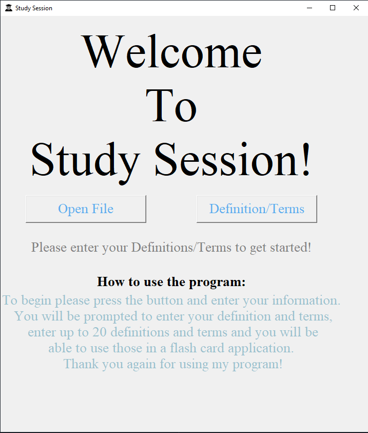
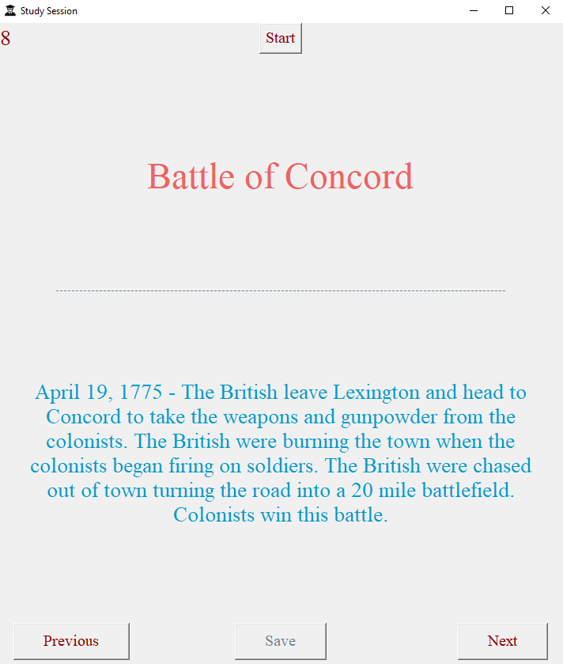

# Study Session

## Table of Contents

- [Features](#features)
- [Examples](#examples)
- [Support](#support)

## Features

- Flashcard application w/ up to 20 available slots for flashcards
- Made using Tkinter & Python

## Examples

**Landing Page**

**Flashcards in action**

## Support

Reach out to me at one of the following places!

- LinkedIn at <a href="https://www.linkedin.com/in/pagezacharyc/" target="_blank">Zachary Page</a>
- Email at <a href='mailto:pagezacharyc@gmail.com' target="_blank">pagezacharyc@gmail</a>

---
